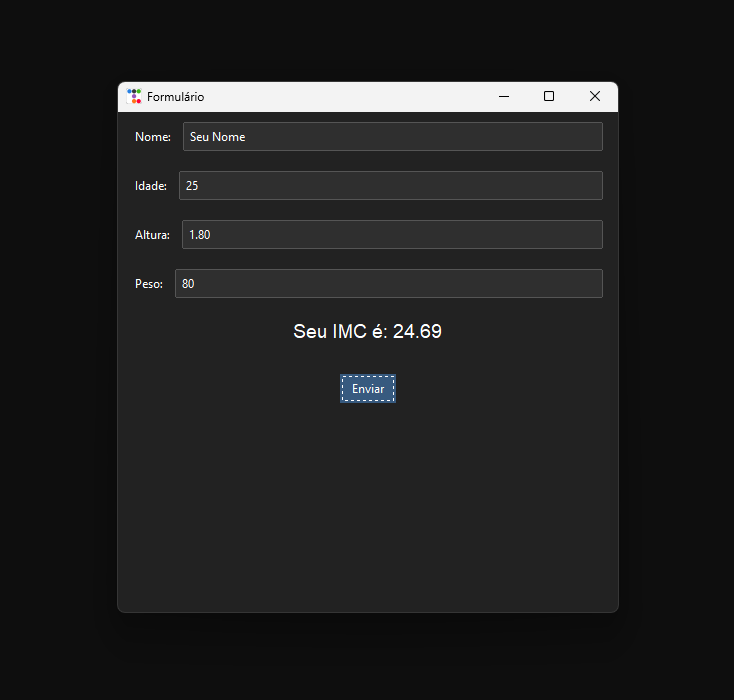

# Primeiro projeto de Python

- Essa é uma aplicação simples, na qual pergunta algumas informações e gera um PDF com seu IMC.
- De primeiro momento não vai ter interface, mas faz parte do projeto
- As formatações do Pdf ainda não estão nem perto do planejado.
- Outras atualizações serão feitas gradualmente conforme o meu aprendizado.
- Será feito uma melhor organização do código
  
# Atualização v2.0
- Feito a criação de uma interface gráfica:

- Alteração na fórmula do IMC
- Entre outras melhorias no código
